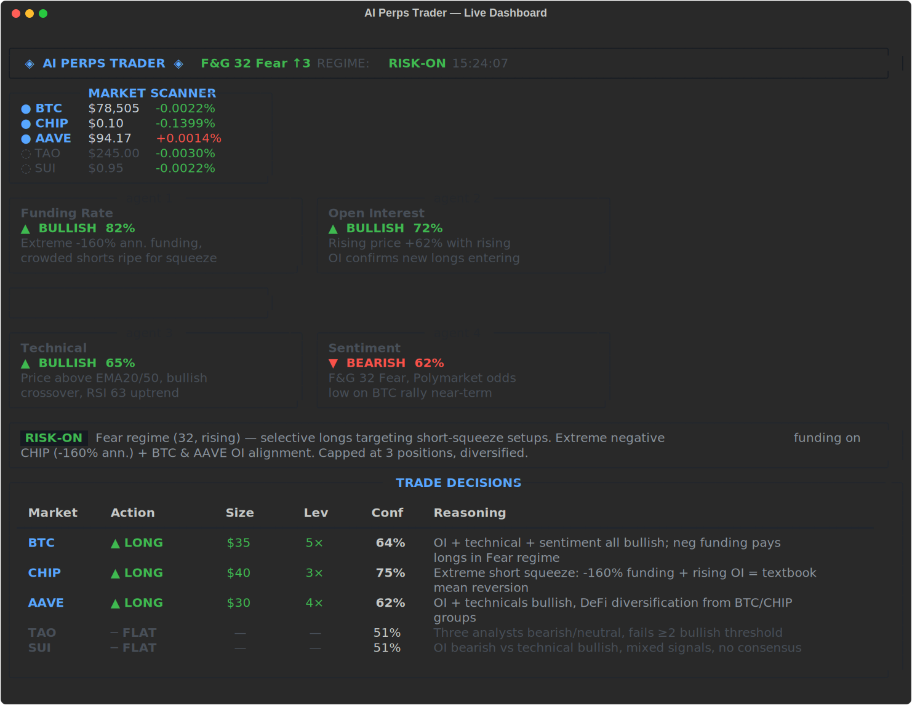
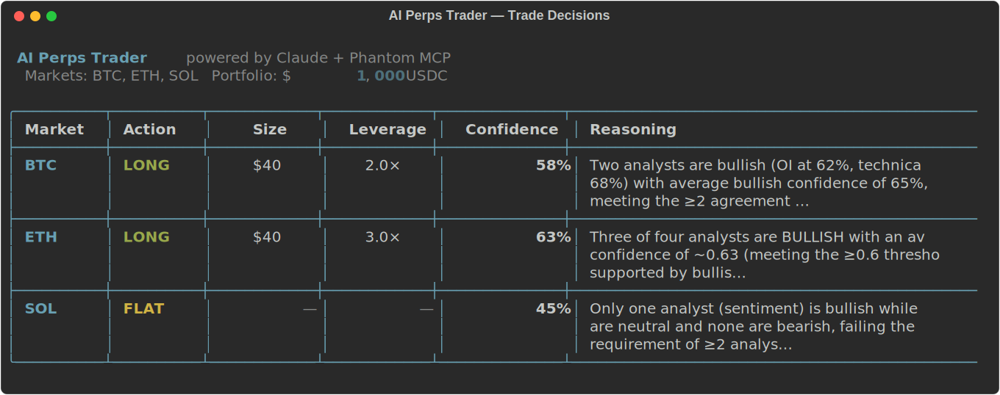
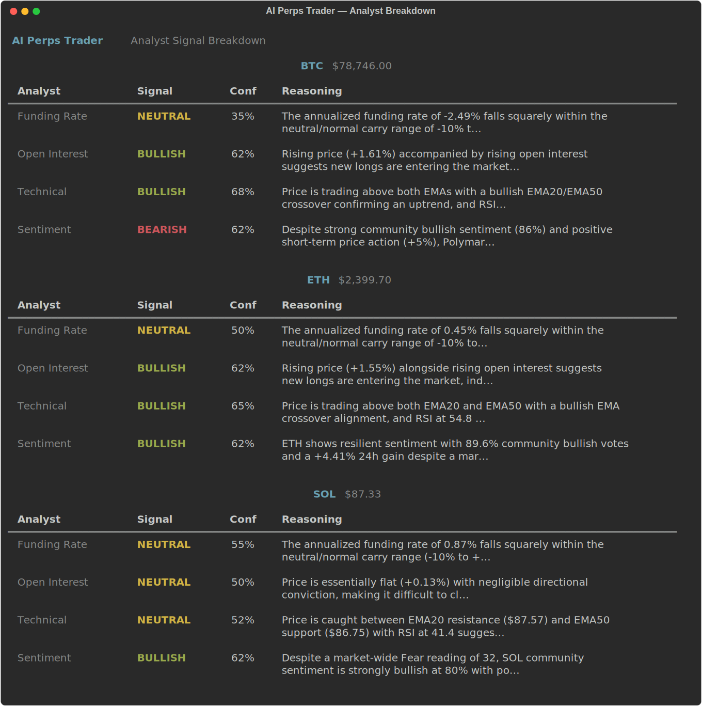

# AI Perps Trader

A multi-agent AI system that autonomously selects, analyzes, and trades perpetuals on [Hyperliquid](https://hyperliquid.xyz) via [Phantom](https://phantom.com) MCP.

Four independent analyst agents run in parallel on live market data. A market selector scans all Hyperliquid perp markets every cycle and picks the 5 best opportunities based on the current macro regime. A portfolio strategist synthesizes the signals into a coherent, correlation-aware portfolio. Execution is one command via Phantom MCP.

Inspired by [ai-hedge-fund](https://github.com/virattt/ai-hedge-fund) — rebuilt for crypto perps.

---

## Demo

**Live terminal dashboard** (`python dashboard.py`)



**Autonomous market selection + trade decisions** (`python run.py`)



**Per-market analyst breakdown**



---

## How it works

```
market_selector
  └── scans all ~150 Hyperliquid markets
  └── filters by liquidity (≥$500K daily volume)
  └── Claude picks 5 markets based on funding extremes,
      volume anomalies, F&G regime, and correlation diversity
          ↓
fetch_market_data  (price · funding · OI · volume)
          ↓
  ┌───────────────────────────────┐
  │  4 analysts run in parallel   │
  │  • Funding Rate  (contrarian) │
  │  • Open Interest (conviction) │
  │  • Technical     (momentum)   │
  │  • Sentiment     (macro/news) │
  └───────────────────────────────┘
          ↓
risk_manager   (caps size · leverage · % of account)
          ↓
portfolio_strategist
  └── reads macro regime (F&G + trend)
  └── only acts when ≥2 analysts agree at ≥60% avg confidence
  └── caps correlated positions (no stacking BTC + ETH + SOL)
  └── outputs sized decisions with full reasoning
          ↓
trade_decisions.json → Phantom MCP → Hyperliquid
```

**Stack:** LangGraph · Claude Sonnet · Hyperliquid REST · CoinGecko · Polymarket · alternative.me · Phantom MCP

---

## Quickstart

**Requirements:** Python 3.11+, [Anthropic API key](https://console.anthropic.com), Phantom wallet with USDC in the perps account.

```bash
git clone https://github.com/Th3Ya0vi/ai-perps-trader
cd ai-perps-trader

python -m venv .venv && source .venv/bin/activate
pip install langgraph langchain-anthropic langchain-core httpx python-dotenv rich pydantic

cp .env.example .env
# add your ANTHROPIC_API_KEY to .env
```

---

## Running

### Live dashboard (recommended)

```bash
python dashboard.py               # auto-select markets, $1000 default
python dashboard.py --portfolio 5000
python dashboard.py --markets BTC,ETH,SOL   # override market selection
```

Keybindings inside the dashboard:
- `r` — re-run the full pipeline
- `q` — quit

### CLI mode

```bash
python run.py                            # auto-select, table output
python run.py --markets BTC,ETH,SOL,WIF  # override markets
python run.py --portfolio 5000           # set account size
python run.py --output json              # machine-readable
```

After each CLI run, decisions are saved to `trade_decisions.json`.

---

## Executing trades via Phantom MCP

Open a [Claude Code](https://claude.ai/code) session in this directory (Phantom MCP must be connected), then:

```
python run.py   # generates trade_decisions.json
```

Tell Claude: **"Execute the trades in trade_decisions.json"**

Claude reads the file and calls `perps_open` for each non-flat decision.

**Automate with a loop:**
```
/loop 15m Run the AI perps trader pipeline and execute any new trade decisions via Phantom MCP
```

The loop runs `run.py`, checks open positions, opens new ones where none exist, and closes + reverses on opposite signals. It skips execution if available balance is under $5.

---

## Configuration

Set in `.env`:

| Variable | Default | Description |
|---|---|---|
| `ANTHROPIC_API_KEY` | — | Required |
| `MODEL` | `claude-sonnet-4-6` | Override the Claude model |
| `MAX_POSITION_SIZE_USD` | `200` | Hard USD cap per position |
| `MAX_LEVERAGE` | `10` | Absolute leverage ceiling |
| `MAX_ACCOUNT_RISK_PCT` | `0.05` | Max % of account per position (5%) |

---

## Analyst agents

| Agent | Edge | Data |
|---|---|---|
| **Funding Rate** | Contrarian — extreme positive funding = crowded longs = fade; extreme negative = crowded shorts = buy | Hyperliquid REST |
| **Open Interest** | Directional — rising OI + rising price = new conviction entering | Hyperliquid REST |
| **Technical** | Momentum/mean-reversion — RSI, EMA(20/50) crossover, Bollinger Bands on 1h candles | Hyperliquid candles |
| **Sentiment** | Macro context — Fear & Greed index trend, CoinGecko community votes, Polymarket prediction odds | alternative.me · CoinGecko · Polymarket |

---

## Disclaimer

Experimental. Trades real money. Start with small sizes. Not financial advice.
